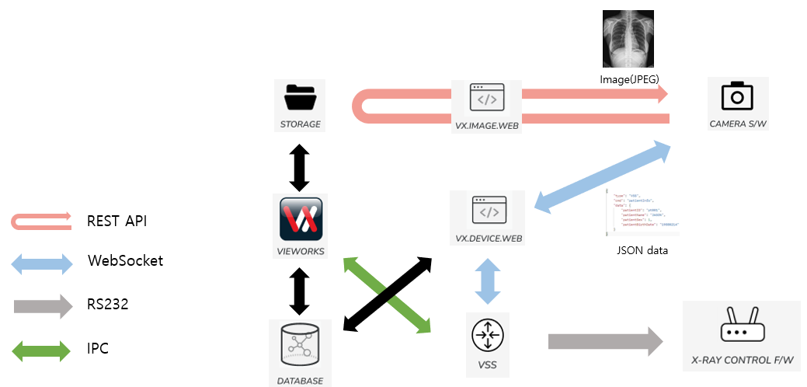

# VXvue Integration WebSocket API

## 1. 소개
다음 WebSocket API는 각종 장치와 Websocket을 통하여 실시간 양방향 통신을 가능하게 합니다.

이를 통하여 VXvue로부터 환자 정보, 검사 정보, 이미지 정보 등 다양한 데이터를 전송 및 수신할 수 있는 API를 제공합니다.

## 2. 시스템 구조


| Module              | Description                         |
|:--------------------|:------------------------------------|
| VXvue               | VXvue                               |
| VSS                 | 각종 장비와 연동하는 인터페이스 모듈   |
| VX.DEVICE.WEB       | VXvue 장비연동 WEB 서비스            |
| VX.IMAGE.WEB        | VXvue 이미지 전송 WEB 서비스         |
| CAMERA S/W          | (Shimadzu) Second monitor 모듈       |
| X-RAY CONTROL F/W   | (Shimadzu) X-ray Control 모듈        |

## 3. 연결 정보
- 통신 방식: Websocket
- **WebSocket URL**: `ws://{IP address}:{Port Number}`
- 기본 IP 주소: `localhost`
- 기본 Port 정보: `55111`

⚠️ 클라이언트는 WebSocket 서버에 연결한 후, Device 정보를 등록하기 위해 [등록명령](#requester-client)을 서버로 전송해야 합니다. 이 명령을 수행하지 않으면 적절한 메시지를 수신하지 못할 수 있습니다.

## 3. 메시지 흐름

### VXvue(VSS)에서 장치로 전송
이 WebSocket API의 워크플로우는 VXvue(VSS)로부터 수신 타입에 메시지를 전송하도록 설계되어 있습니다. 흐름은 다음과 같습니다:

1. 클라이언트가 서버 ``ws://(IP):(Port Number)``에 연결합니다.
2. 클라이언트가 [등록명령](#requester-client)을 서버에 전송하여 [클라이언트 타입: sender 참조](#공통-메시지-구조-정의)을 등록합니다.
3. VXvue(VSS)가 디스플레이 이벤트를 WebSocket 서버로 전송합니다.
4. WebSocket 서버는 이벤트를 수신하고 이를 처리합니다.
5. 서버는 이벤트를 모든 연결된 장치(예: 두 번째 모니터)로 브로드캐스트합니다.
6. 각 클라이언트는 이벤트를 수신하고 적절히 처리할 수 있습니다 (예: UI 업데이트).
  
## 4. 메시지

### 정의
WebSocket 연결을 통해 송수신되는 메시지는 JSON 형식입니다.

아래는 클라이언트가 사용할 메시지 구조와 서버가 처리할 수 있는 명령어의 유형을 나타냅니다.

### 공통 메시지 구조 정의

* sender: 송신자(최초 이벤트 발생자) 타입
  * Type: number
  * Values
    * 0: [default] Not Registered
    * 1: VXvueWebServer (me)
    * 2: VXvue(VSS)
    * 106: Display
* receiver: 수신자 타입
  * Type: number | null
  * Values 
    * 0: All
    * 1: VXvueWebServer
    * 2: VXvue(VSS)
    * 106: Display
* command: 커멘드
  * Type: number
  * Values: [4-1 Commands 참조](#4-1-commands)
* result: 응답 결과
  * Type: number null
  * Values:
    * 0: false
    * 1: true
* data: 데이터
  * Type: json | null

#### Example

``` json
{
    "sender": 1,
    "receiver": 106,
    "command": 101,
    "result": 1, // 1: true, 0: failure
    "data": {
        "patientID": "pt-1878",
        "patientName": "json",
        "patientSex": 1,
        "patientBirthDate": "19990121"
    }
}
```

### 4-1 Commands

#### Ping
- Description
  - 통신 연결 상태를 확인합니다.
- Client Request
  - sender: 
    - [공통 메시지 구조 정의: sender 참조](#공통-메시지-구조-정의)
  - command: 
    - 1 (ping)
  - example
    ``` json
    {
      "sender": 106,
      "command": 1
    }
    ```
  
- Server Response
  - sender: 
    - 1 (VXvueWebServer)
    - [공통 메시지 구조 정의: sender 참조](#공통-메시지-구조-정의)
  - command: 
    - 1 (ping) 
  - result
    - 0 (fail)
    - 1 (success)
  - example
  ``` json
  {
    "sender": 1,   // 1: VXvueWebServer 
    "command": 1,  // 1: ping
    "result": 1, // 0: fail, 1: success
  }
  ```

#### Register Client
- Description
  - Client Type을 Server에 등록합니다.
- Client Request
  - sender: 
    - 모두 가능
    - [공통 메시지 구조 정의: sender 참조](#공통-메시지-구조-정의)
  - command: 
    - 11 (registerClient)
  - example
    ``` json
    {
      "sender": 106,
      "command": 11
    }
    ```
  
- Server Response
  - sender: 
    - 1 (VXvueWebServer)
    - [공통 메시지 구조 정의: sender 참조](#공통-메시지-구조-정의)
  - command: 
    - 11 (registerClient) 
  - data
    - status
      - 0 (fail)
      - 1 (success)
    - error
      - number | null
  - example
  ``` json
    {
      "sender": 1,    // 1: VXvueWebServer 
      "command": 11,  // 11: requesterClient
      "data": {
        "status": 1, // 0: fail, 1: success, 
      }
    }
  ```

#### Send Patient Information
- Description
  - Server가 Receiver들에게 Patient 정보를 전송합니다.
- Client Request
  - sender: 
    - 2  (VXvue)
    - [공통 메시지 구조 정의: receiver 참조](#공통-메시지-구조-정의)
  - receiver : 
    - 106 (Display)
    - [공통 메시지 구조 정의: receiver 참조](#공통-메시지-구조-정의)
  - command: 
    - 101 (setPatientInfo)
  - data
    - patientId
      - type: string
    - patientName
      - type: string | null
    - patientBirth
      - type: string | null
      - format: date
        - "Date in the format YYYY-MM-DD, Following ISO 8601"
  - example
  ``` json
    {
      "sender": 2,     // 2: VXvue(VSS)
      "receiver": 106,  // 106: Display
      "command": 101,  // 101: setPatientInfo
      "data": {
        "patientId": "EM-240906-134326",
        "patientName": "Doe^John",
        "patientBirth": "1988-02-14"
      }
    }
  ```

#### Send Protocol(Step) Information
- Description
  - Server가 Receiver들에게 Protocol(Step) 정보를 전송합니다.
- Client Request
  - sender: 
    - 2  (VXvue)
    - [공통 메시지 구조 정의: receiver 참조](#공통-메시지-구조-정의)
  - receiver : 
    - 106 (Display)
    - [공통 메시지 구조 정의: receiver 참조](#공통-메시지-구조-정의)
  - command: 
    - 601 (sendStepInfo)
  - data
    - bodypartAlias
      - type: string | null
    - projectionAlias
      - type: string | null
  - example
  ``` json
    {
      "sender": 2,     // 2: VXvue(VSS)
      "receiver": 106,  // 106: Display
      "command": 601,  // 601: sendStepInfo
      "data": {
        "bodypartAlias": "CHEST",
        "projectionAlias": "AP",
      }
    }
  ```

#### Start Study(Exam)
- Description
  - Server가 Receiver들에게 Study가 시작되었음을 알립니다.
- Client Request
  - sender: 
    - 2 (VXvue)
    - [공통 메시지 구조 정의: receiver 참조](#공통-메시지-구조-정의)
  - receiver : 
    - 106 (Display)
    - [공통 메시지 구조 정의: receiver 참조](#공통-메시지-구조-정의)
  - command: 
    - 1001 (eventStartExam)
  - example
  ``` json
    {
      "sender": 2,      // 2: VXvue(VSS)
      "receiver": 106,  // 106: Display
      "command": 1001,  // 1001: eventStartExam
    }
  ```

#### Complete Study(Exam)
- Description
  - Server가 Receiver들에게 Study가 완료되었음을 알립니다.
- Client Request
  - sender: 
    - 2 (VXvue)
    - [공통 메시지 구조 정의: receiver 참조](#공통-메시지-구조-정의)
  - receiver : 
    - 106 (Display)
    - [공통 메시지 구조 정의: receiver 참조](#공통-메시지-구조-정의)
  - command: 
    - 1002 (eventCompleteExam)
  - example
  ``` json
    {
      "sender": 2,      // 2: VXvue(VSS)
      "receiver": 106,  // 106: Display
      "command": 1002,  // 1002: eventCompleteExam
    }
  ```